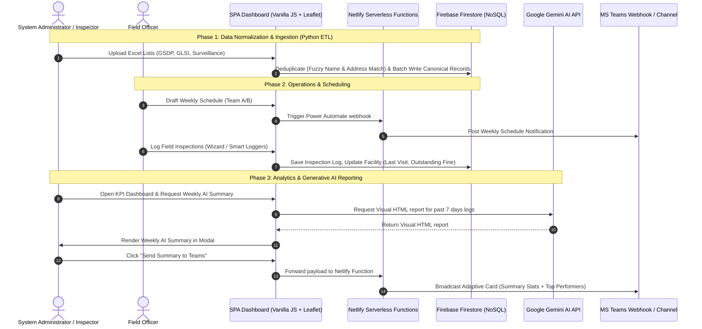

# Project Portfolio: NAFDAC Post Marketing Surveillance (PMS) Digital System
### Senior Full-Stack & Data Engineer Portfolio

---

## Executive Summary

The **NAFDAC Post Marketing Surveillance (PMS) Digital System** is an enterprise-grade, field-ready Single Page Application (SPA) and backend ecosystem designed to digitize, normalize, schedule, and track food and drug surveillance operations across Lagos State, Nigeria. 

Prior to this system's deployment, NAFDAC surveillance records were scattered across **15 legacy Excel spreadsheets** with inconsistent naming conventions, unstandardized addresses, and duplicate entries. Field teams scheduled inspections manually, and reporting was delayed.

This digital system provides:
1. **A Unified Canonical Database**: Generated using a custom Python ETL pipeline with fuzzy logic and address-matching deduplication algorithms.
2. **Interactive Map & GIS Coverage**: Visualizing facility clusters and inspection logs with real-time heat maps using Leaflet.js and OpenStreetMap.
3. **KPI & Performance Dashboard**: Rich statistics and Chart.js reporting to monitor routines, complaints, and sanctions, with automatic CSV exporters.
4. **Intelligent Field Loggers & Scheduling**: Multi-step wizard logging, Team A/B scheduling, geocoding fallbacks, and real-time inspector leaderboards.
5. **Generative AI Reports**: Integration with the Google Gemini API to compile raw inspection logs into beautifully structured HTML summary tables and executive writeups.
6. **Enterprise Notification Pipeline**: Netlify serverless functions power a Microsoft Teams adaptive card broadcast pipeline and bot workspace commands.

---

## System Architecture

The following diagram illustrates how the components of the NAFDAC PMS Digital System interact.

---

## Core Engineering Modules

### 1. Data Engineering: Deduplication & ETL Pipeline
*   **Technologies**: Python 3, `openpyxl`, `re`, `hashlib`
*   **Source Code**: [etl_facilities.py](file:///Users/work/Desktop/dailylog/etl_facilities.py)
*   **Fuzzy Deduplication & Merging**: [merge-facilities.js](file:///Users/work/Desktop/dailylog/merge-facilities.js), [merge-facilities.html](file:///Users/work/Desktop/dailylog/merge-facilities.html)

#### Architectural Achievements:
-   **Excel Aggregator**: Created a Python ETL tool that extracts, cleans, and merges records across 15 spreadsheets representing different areas (Lagos Central, East, West), statuses (Inspected vs. Uninspected), and activity domains (GSDP, GLSI, Revenue, Defaulters).
-   **Fuzzy Normalization Algorithm**: Standardizes facility names and addresses by stripping corporate noise words (`LTD`, `PLC`, `PHARMACEUTICALS`, `VENTURES`, etc.) and non-alphanumeric noise to build a deterministic match key.
-   **Multi-Vector Match Engine**: Deduplicates entries using a three-tiered matching system:
    1.  *Exact Name Match*: Direct name string equality.
    2.  *Match Key Similarity*: Canonical name suffix reduction.
    3.  *Address Distance Match*: Validates substantial address substrings to merge facilities listed under slightly different names.
-   **Real-time Refactoring Database Batches**: Resolves duplicate records in Firestore by designating a "Master" record (prioritizing the one with the most historical logs, complete contact information, and valid file numbers), re-linking all historical inspection, sanction, complaint, and document logs to it, and marking duplicate records as `status: "MERGED"` to preserve historical mapping integrity.

---

### 2. Operations & Field Inspection Scheduling
*   **Technologies**: JavaScript (ES6 Modules), Choices.js, Nominatim API
*   **Source Code**: [scheduler.js](file:///Users/work/Desktop/dailylog/scheduler.js)

#### Architectural Achievements:
-   **Team A/B Schedule Matrix**: Dual-schedule management system that lets planners build independent weekly plans.
-   **Fuzzy Area-to-LGA Matcher**: Automatically filters facility options inside scheduling forms based on local area aliases (e.g. typing "Lekki" or "VI" auto-associates with "Eti-Osa"; typing "Yaba" maps to "Lagos Mainland").
-   **Geocoding Integration**: Combines OpenStreetMap Nominatim geocoding to look up coordinates inside Lagos State, with a quick fallback Google Maps search link to prevent user blockages.
-   **Dynamic History Badges**: As soon as a facility is chosen, the scheduler queries Firestore to display a status badge (e.g. `Last: 2026-05-12` or `Never Visited`) helping planners prioritize neglected outlets.

---

### 3. KPI Analytics Dashboard & Performance Tracking
*   **Technologies**: Chart.js, Vanilla JS, Google Gemini API
*   **Source Code**: [dashboard.js](file:///Users/work/Desktop/dailylog/dashboard.js), [weekly.js](file:///Users/work/Desktop/dailylog/weekly.js)

#### Architectural Achievements:
-   **Four-Chart Visual Board**: Uses Chart.js to render four distinct inspection profiles:
    -   *Activities breakdown* (Pie chart)
    -   *Holds vs. Mop-ups comparison* (Stacked bar chart)
    -   *GSDP GDP/CEVI sub-activities* (Doughnut chart)
    -   *Sanctions issued* (Line chart)
-   **Dynamic Leaderboard Matrix**: Tracks inspector productivity in real-time, filtering out non-inspection entries (administrative / consultative), parsing comma-separated and array-based inspectors, and displaying progress bars with Gold, Silver, and Bronze medals for top performers.
-   **Visual AI-Powered Reporting**: Integrates Google Gemini API (`gemini-2.0-flash`) directly on the client side. The module extracts the last 7 days of inspection telemetry and formats a prompt asking Gemini to compile an executive briefing containing styled HTML tables detailing activity summaries, key actions, and a trend narrative.
-   **CSV Telemetry Exporter**: Formulates clean CSV data exports by dynamically escaping columns containing commas, double quotes, or newlines to ensure spreadsheet viewer compatibility.

---

### 4. Interactive GIS Map Layer
*   **Technologies**: Leaflet.js (Map & MarkerCluster)
*   **Source Code**: [map.js](file:///Users/work/Desktop/dailylog/map.js)

#### Architectural Achievements:
-   **LGA Coordinate Heat Map**: Displays approximate centers for 20 Lagos Local Government Areas (LGAs) and colors them based on facility density.
-   **Overlay Layer Toggles**: Allows users to filter view layers between *Pre-registered Facilities* (Green Pins) and *Logged Inspections* (Orange Pins), and toggle between *Street Map* and *Satellite Imagery* views.
-   **Jitter Coordinates Generator**: Solves coordinate overlap issues. Because legacy facilities only had addresses (and no GPS coordinates), they are mapped to the LGA center. The system uses a random-jitter algorithm ($\pm 1.5\text{ km}$ offset) to scatter overlapping facilities so they remain individually clickable on zoom.
-   **Dynamic Popup Summaries**: Pins feature custom HTML popup boxes linking to Google Maps driving directions and display details (last visit date, activity type, inspector lists, and remarks).

---

### 5. Smart Incident Loggers
*   **Technologies**: Vanilla CSS, Choices.js
*   **Source Code**: [smart-loggers.js](file:///Users/work/Desktop/dailylog/smart-loggers.js), [facility-utils.js](file:///Users/work/Desktop/dailylog/facility-utils.js)

#### Architectural Achievements:
-   **Real-time Consumer Complaints Logger**: Logs complaints with dual-facility associations. For example, if a consumer logs an issue with a product, the logger can link it both to the *Outlet / Place of Purchase* and the *Manufacturer / Importer*, creating linked document logs under both facility profiles in Firestore.
-   **Financial Sanction Ledger**: Links administrative fines directly to the corresponding facility. On submission, the logger performs an atomic increment to update the facility's `totalFinesIssued` and `outstandingFines` values in Firestore.
-   **Automatic Inline Facility Generator**: If a facility doesn't exist during logging, selecting `+ Add New Facility` reveals nested forms. On save, the system resolves the new facility in the background and returns its generated ID to complete the main log seamlessly.

---

### 6. MS Teams Serverless Webhook Bot
*   **Technologies**: Netlify Functions (Node.js REST API), Adaptive Cards
*   **Source Code**: [bot-brain.js](file:///Users/work/Desktop/netlify/functions/bot-brain.js), [bot-processor.js](file:///Users/work/Desktop/netlify/functions/bot-processor.js)

#### Architectural Achievements:
-   **Adaptive Cards Summary Dispatcher**: Serializes Weekly Summaries into a Microsoft Teams Adaptive Card schema, laying out column sets, activity stats, top inspectors, and links in a high-density, professional card broadcast.
-   **Teams Conversation Bot State Machine**: Handles stateful interaction within Teams channels. When users type commands, the bot listens to states, ignoring non-log commands when in an idle state to prevent resource drain.
-   **Dynamic Module Loader**: Bypasses Netlify bundler limits. Since Netlify bundlers inspect Firebase configuration paths at build time, the chatbot serverless function loads credentials dynamically at runtime to prevent bundler failure.

---

## Technical Stack Summary

| Technology | Domain | Role & Implementation |
| :--- | :--- | :--- |
| **Vanilla JavaScript** | Frontend Core | ES6 modules, Router SPA, event binding |
| **CSS3** | Interface Style | Custom variables, layout structure, responsive flexbox/grid |
| **Firebase Firestore** | Core Database | Real-time NoSQL database, compound indexes, atomic writes |
| **Firebase Auth** | Identity Management | Google Single Sign-On (SSO) popup routing, role permissions |
| **Python 3** | Data Engineering | Excel parsing, fuzzy key mapping, hashing algorithms |
| **Leaflet.js** | GIS Visualization | Geocoding renders, marker clusters, custom map controls |
| **Chart.js** | Analytics Reporting | High-performance HTML5 canvas charting |
| **Google Gemini API** | Artificial Intelligence | Weekly report summaries using `gemini-2.0-flash` |
| **Node.js (Netlify)** | Serverless Backend | Microsoft Teams chatbot webhooks & routing |
| **Choices.js** | Select Forms | Searchable, taggable dropdowns with remote caches |

---

## Key Technical Problems Solved

### 1. The Legacy Spreadsheet Mess (Data Deduplication)
*   **Problem**: Ingesting facilities from 15 spreadsheets resulted in duplicate records due to slight name variations (e.g. *"Emzor Pharm"* vs *"Emzor Pharmaceuticals Ltd"* vs *"Emzor Pharm. Limited"*).
*   **Solution**: Written in [facility-utils.js](file:///Users/work/Desktop/dailylog/facility-utils.js) and [etl_facilities.py](file:///Users/work/Desktop/dailylog/etl_facilities.py), a name-cleansing function strips punctuation and common suffixes in order of string length. It then hashes the normalized string to yield a stable identifier. A fuzzy address matching system checks if the facility shares a similar location string (minimum 15 characters matching), merging duplicates while keeping a registry of name aliases.

### 2. Coordinates Overlap (Marker Collision on Maps)
*   **Problem**: Because legacy records only had addresses, geocoded coordinates placed all facilities in a given LGA at the exact same latitude/longitude coordinate point. Renders stacked these pins on top of each other, making them unclickable.
*   **Solution**: In [map.js](file:///Users/work/Desktop/dailylog/map.js), when rendering facilities without precise GPS coordinates, a random-jitter offset is applied:
    $$\Delta = (\text{random}() - 0.5) \times 0.03$$
    This scatters facilities within a $1.5\text{ km}$ radius of the LGA center. Renders are then fed into the Leaflet `MarkerClusterGroup`, allowing users to zoom in and click individual records.

### 3. Serverless Runtime Bundling Conflicts (Netlify Functions)
*   **Problem**: When deploying the Teams bot endpoint on Netlify, the build engine scanned imports and threw compile-time bundling errors because Firebase-Admin dependencies expected specific JSON configuration files to exist locally.
*   **Solution**: In [firebase-admin-init.js](file:///Users/work/Desktop/netlify/functions/firebase-admin-init.js), credentials are loaded dynamically inside try-catch blocks at runtime. If local files are absent, it falls back to environment variables, bypassing build-time bundler checks and ensuring clean serverless builds.
